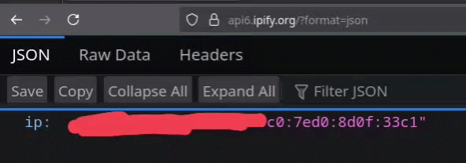

# 🧦 socks-ipv6-relay

A high-performance **SOCKS4a/SOCKS5** relay that assigns a unique IPv6 address to each connection from a given prefix.

> Useful for load distribution, IP rotation, and bypassing rate limits.

---

## ✨ Features

* 🔁 Per-connection IPv6 address rotation
* 🌐 Works with any routed IPv6 prefix (e.g. `/64`)
* ⚡ Lightweight and fast (pure Go)
* 🐳 Docker support
* 🔧 Minimal configuration

---

## 🚀 Getting Started

### Build

```bash
go build -o bin/socks-ipv6-relay ./cmd/socks-ipv6-relay
```

Test binary:

```bash
go build -o bin/socks-ipv6-relay-test ./cmd/socks-ipv6-relay-test
```

---

### Run

```bash
bin/socks-ipv6-relay \
  --prefix 2a01:4f9:abcd:1234::/64 \
  --iface eth0 \
  --listen :1080
```

---

## 🐳 Docker

### Build

```bash
docker build -t socks-ipv6-relay .
```

### Run

```bash
docker run --rm \
  --network host \
  --cap-add NET_ADMIN \
  --cap-add NET_RAW \
  socks-ipv6-relay \
  --prefix 2a01:4f9:abcd:1234::/64 \
  --iface eth0 \
  --listen :1080
```

---

## ⚙️ Configuration

### Flags

| Flag          | Description                          |
| ------------- | ------------------------------------ |
| `--prefix`    | IPv6 prefix (e.g. `/64`)             |
| `--iface`     | Network interface (e.g. `eth0`)      |
| `--listen`    | SOCKS5 listen address                |
| `--log-level` | Log level (debug, info, warn, error) |

---

## 📋 Requirements

* Linux host with IPv6 enabled
* Routed IPv6 prefix
* Kernel setting:

```bash
sudo sysctl -w net.ipv6.ip_nonlocal_bind=1
```

---

## 🔐 Permissions

The relay requires:

* `CAP_NET_ADMIN`
* `CAP_NET_RAW`
* or root privileges

---

## 🧪 Development (Justfile)

```make
build:
    go build -o bin/socks-ipv6-relay ./cmd/socks-ipv6-relay

build-test:
    go build -o bin/socks-ipv6-relay-test ./cmd/socks-ipv6-relay-test

run-proxy *args:
    bin/socks-ipv6-relay {{ args }}

test-proxy *args:
    bin/socks-ipv6-relay-test {{ args }}

docker-build:
    docker build -t socks-ipv6-relay .

docker-run *args:
    docker run --rm \
        --network host \
        --cap-add NET_ADMIN \
        --cap-add NET_RAW \
        socks-ipv6-relay {{ args }}

docker-run-test *args:
    docker run --rm \
        --add-host=host.docker.internal:host-gateway \
        --entrypoint /app/bin/socks-ipv6-relay-test \
        socks-ipv6-relay {{ args }}
```

---

## 🧠 How It Works

Each outbound connection:

1. Selects a random IPv6 address from the provided prefix
2. Binds the socket to that address
3. Forwards traffic via SOCKS5

This makes every connection appear to originate from a different IP.

---

## Demo preview (IPv6 source rotation)

Each request uses a different IPv6 source address.

[](img/socks-ipv6-relay-demo.mp4)

---

## 📄 License

MIT