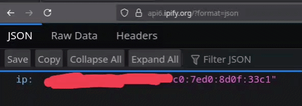

# 🧦 socks-ipv6-relay

A high-performance **SOCKS4a/SOCKS5** relay that assigns a unique IPv6 address to each connection from a given prefix.

> Useful for load distribution, IP rotation, and bypassing rate limits.

---

## ✨ Features

* 🔁 Per-connection IPv6 address rotation
* 🌐 Works with any routed IPv6 prefix (e.g. `/64`)
* ⚡ Lightweight and fast (pure Go)
* 🐳 Docker support
* 🔧 Minimal configuration

---

## 🚀 Getting Started

### Build

```bash
go build -o bin/socks-ipv6-relay ./cmd/socks-ipv6-relay
```

Test binary:

```bash
go build -o bin/socks-ipv6-relay-test ./cmd/socks-ipv6-relay-test
```

Standalone NDP proxy (optional, for on-link prefixes — see below):

```bash
go build -o bin/ndp-proxy ./cmd/ndp-proxy
```

---

### Run

```bash
bin/socks-ipv6-relay \
  --prefix 2a01:4f9:abcd:1234::/64 \
  --iface eth0 \
  --listen :1080
```

---

## 🐳 Docker

### Build

```bash
docker build -t socks-ipv6-relay .
```

### Run

Do the [host setup](#host-setup) first, then the relay needs no capabilities:

```bash
docker run --rm \
  --network host \
  socks-ipv6-relay \
  --prefix 2a01:4f9:abcd:1234::/64 \
  --listen :1080
```

`ndp-proxy`, for on-link prefixes, still needs both capabilities:

```bash
docker run --rm \
  --network host \
  --cap-add NET_RAW \
  --entrypoint /app/bin/ndp-proxy \
  socks-ipv6-relay \
  --prefix 2a01:4f9:abcd:1234::/64 \
  --iface eth0
```

> `--network host` shares the host's network namespace, so the container sees
> the host's `ip_nonlocal_bind` and local route. Without it, configure the
> settings inside the container's own namespace instead.

---

## ⚙️ Configuration

### Flags

| Flag                             | Default      | Description                                                          |
| -------------------------------- | ------------ | -------------------------------------------------------------------- |
| `--prefix`                       | *(required)* | IPv6 prefix to rotate through (e.g. `2a01:4f9:abcd:1234::/64`)        |
| `--iface`                        | *(optional)* | Interface name, used only to make preflight messages concrete         |
| `--listen`                       | `:1080`      | SOCKS4a/SOCKS5 listen address                                        |
| `--network`                      | `tcp`        | Listen network                                                       |
| `--random`                       | `true`       | Random addresses within the prefix; `false` = incremental             |
| `--user`                         | *(empty)*    | Username for authentication                                          |
| `--pass`                         | *(empty)*    | Password for authentication                                          |
| `--allow-connect`                | `true`       | Allow SOCKS `CONNECT`                                                |
| `--connect-timeout`              | `60s`        | Timeout for `CONNECT` operations                                     |
| `--allow-udp-associate`          | `true`       | Allow SOCKS5 `UDP ASSOCIATE`                                         |
| `--udp-associate-advertise-addr` | *(empty)*    | Address advertised to clients for the UDP relay                      |
| `--udp-associate-timeout`        | `60s`        | Timeout for `UDP ASSOCIATE` operations                               |
| `--skip-preflight`               | `false`      | Skip the host configuration checks                                   |
| `--log-level`                    | `0`          | slog level as an integer: `-4`=DEBUG, `0`=INFO, `4`=WARN, `8`=ERROR   |

Authentication is enforced only when **both** `--user` and `--pass` are set.

The prefix may be any length; addresses are generated strictly within it, including
non-byte-aligned prefixes such as `/60`.

---

## 📋 Requirements

* Linux host with IPv6 enabled
* An IPv6 prefix that is **routed to the host** (see below)

### Host setup

Neither binary changes host network settings. Both **check** the two settings
the data path depends on at startup and refuse to run with an actionable error
if either is missing, so configure them once as the operator:

```bash
# let sockets bind addresses that are not configured on an interface
sudo sysctl -w net.ipv6.ip_nonlocal_bind=1

# let the kernel accept inbound packets for every address in the prefix
sudo ip -6 route add local 2a01:4f9:abcd:1234::/64 dev eth0 table local
```

Make them persist across reboots:

```bash
echo 'net.ipv6.ip_nonlocal_bind=1' | sudo tee /etc/sysctl.d/99-socks-ipv6-relay.conf
```

The route belongs in whatever manages your interfaces (a systemd unit,
`/etc/network/interfaces` `post-up`, netplan, …). `just setup-host` applies both
for a quick trial; it is not persistent.

Pass `--skip-preflight` to bypass the checks if you configure the host some
other way, e.g. by assigning the addresses to an interface directly.

### Routed vs on-link prefixes

The relay binds sockets to addresses it never configures on an interface. That
works only if the upstream router forwards the whole prefix to your host
without resolving individual addresses.

**Routed prefix** (e.g. Hetzner dedicated, gateway `fe80::1`) — works as-is.
The router has a static route for the prefix and never sends Neighbor
Solicitations for individual addresses.

**On-link prefix** (common on VPS providers such as Contabo) — the gateway sits
inside your own prefix and sends a Neighbor Solicitation for each destination
address. The kernel only answers those for addresses actually configured on an
interface, so return traffic for a generated address is dropped and connections
hang. Check which one you have:

```bash
ip -6 route show default
# via fe80::1                    -> usually routed, nothing more to do
# via <address in your prefix>   -> on-link, NDP answers required
```

For an on-link prefix, run the bundled **`ndp-proxy`** binary alongside the relay.
It answers Neighbor Solicitations for every address in the prefix so the gateway
delivers the return traffic:

```bash
ndp-proxy --prefix 2a01:4f9:abcd:1234::/64 --iface eth0
```

`ndp-proxy` runs the same preflight checks as the relay and likewise changes no
host settings — do the host setup above first. Run it as a background service
alongside the relay.

> **Why not `ndppd` / kernel `proxy_ndp`?** Both answer solicitations, but their
> Neighbor Advertisements have the **Override flag cleared**. Some gateways
> (observed on Contabo) silently ignore any NA without Override and keep
> re-soliciting forever, so those tools appear to do nothing while return traffic
> is dropped. `ndp-proxy` advertises with Router+Solicited+**Override** set —
> byte-for-byte what a natively-assigned address sends — which the gateway
> accepts. Confirm on the wire with:
>
> ```bash
> tcpdump -ni eth0 -vv 'icmp6 && (ip6[40]==135 || ip6[40]==136)'
> # a natively-assigned address answers with Flags [solicited, override];
> # if the gateway keeps re-soliciting after an NA, it needs Override -> use ndp-proxy.
> ```

`ndp-proxy` requests allmulticast on its own packet socket, so it receives
solicitations for addresses that are not configured on the interface. The kernel
reference counts that request against the socket and drops it when the socket
closes, so it cannot outlive the process — even if it is killed with `SIGKILL`.
The interface flag itself is never modified.

---

## 🔐 Permissions

**`socks-ipv6-relay` needs no capabilities.** It only binds sockets and reads
two host settings, so it runs as an unprivileged user once the host setup above
is done.

**`ndp-proxy` requires `CAP_NET_RAW`** (or root) to open the `AF_PACKET` socket it
receives Neighbor Solicitations on, and to request allmulticast on that socket.
It changes no interface or host settings, so `CAP_NET_ADMIN` should not be
needed.

> Previous releases also required `CAP_NET_ADMIN`, because allmulticast was set
> as an interface flag over netlink. If `ndp-proxy` fails to start with
> `operation not permitted`, add `CAP_NET_ADMIN` back and please open an issue.

The host setup itself requires root, but is done once, out of band.

---

## 🧪 Development (justfile)

```bash
just build            # build both binaries into bin/
just run-proxy  --prefix 2a01:4f9:abcd:1234::/64 --iface eth0
just test-proxy --proxy 127.0.0.1:1080
just docker-build
just docker-run --prefix 2a01:4f9:abcd:1234::/64 --iface eth0
```

Run the tests with:

```bash
go test ./...
```

---

## 🧠 How It Works

The host setup provides two things: `net.ipv6.ip_nonlocal_bind` lets sockets bind
addresses the host does not own, and the `local <prefix>` route makes the kernel
accept inbound packets for every address in the prefix. The relay verifies both
at startup and never changes them.

Then, for each outbound connection:

1. Selects an address from the provided prefix (random by default, or incremental with `--random=false`)
2. Binds the socket to that address
3. Forwards traffic via SOCKS4a/SOCKS5

This makes every connection appear to originate from a different IP, without
configuring an interface address per connection.

On an on-link prefix, the separate `ndp-proxy` binary answers IPv6 Neighbor
Solicitations for the whole prefix (with the Override flag set) so the gateway
delivers the return traffic. It uses a raw `AF_PACKET` socket (needs
`CAP_NET_RAW`) with allmulticast requested on that socket. See
*Routed vs on-link prefixes* above.

---

## Demo preview (IPv6 source rotation)

Each request uses a different IPv6 source address.

[](img/socks-ipv6-relay-demo.gif)

---

## 📄 License

[MIT](LICENSE)
